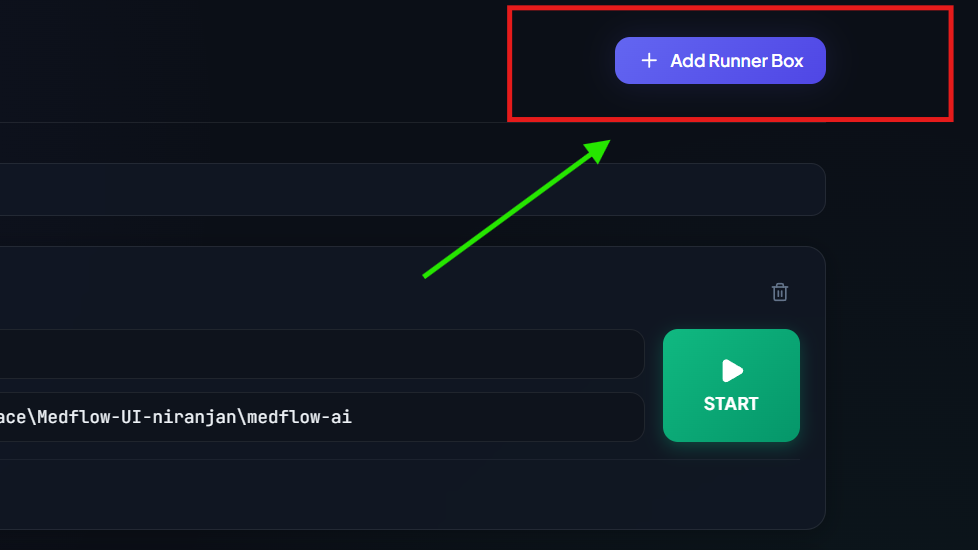
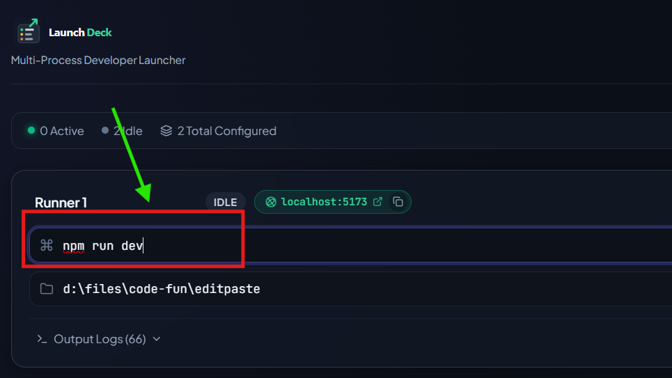
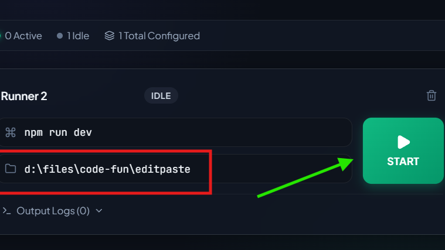
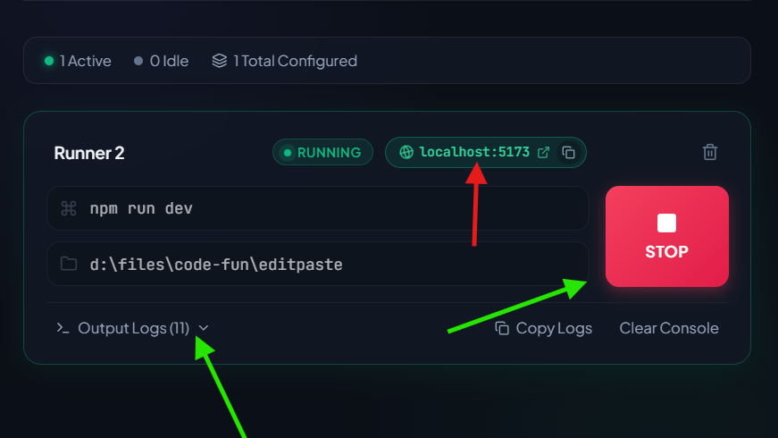

# Launch Deck 🚀

> **Multi-Process Developer Launcher** — A lightweight, desktop dashboard built with Tauri, React, and TypeScript to orchestrate, run, and monitor multiple development servers and background tasks simultaneously.

---

## 📸 Visual Walkthrough & Usage

### 1. Add Runner Box
Easily organize your services. Click the **+ Add Runner Box** button to configure a new process card for your backend, frontend, worker, or custom script.



---

### 2. Configure Command
Specify the launch command you want to run (e.g., `npm run dev`, `cargo run`, `mvn spring-boot:run`, or `python app.py`).



---

### 3. Set Working Directory & Start
Set the target project folder or working directory path (`cwd`) where the command should execute, then press **START**.



---

### 4. Live Process Monitoring, Auto-URL Detection & Output Logs
Once started, Launch Deck monitors the process status in real-time:
- **Automatic Localhost & Port Detection**: Detects URLs (such as `localhost:5173`) from standard output so you can launch them in your browser with a single click or copy to clipboard.
- **Collapsible Real-Time Logs**: View, expand, and inspect streaming stdout/stderr outputs with ANSI color stripping.
- **One-Click Controls**: Easily stop processes, clear logs, or copy terminal output.



---

## ✨ Key Features

- ⚡ **Multi-Process Management**: Launch and manage multiple dev servers (frontend, backend, databases, mock APIs) concurrently from one unified UI.
- 🌐 **Instant URL Detection**: Automatically parses stdout/stderr to detect active `localhost` / `127.0.0.1` web addresses with direct browser launch and copy buttons.
- 📜 **Live Terminal Output & Streaming**: View buffered, ANSI-cleaned stdout/stderr logs with easy copy and clear functions.
- 💾 **Automatic Configuration Persistence**: Your configured runner cards, commands, and directories are saved locally so they are ready every time you open the app.
- 🛡️ **Race-Safe Process Lifecycle**: Generation-tracked process state management ensures stale logs or exit events never trigger ghost states or incorrect UI states.
- 🖥️ **Lightweight Native Desktop App**: Powered by Tauri v2 with minimal resource usage and instant startup.

---

## 🛠️ Tech Stack

- **Framework**: [Tauri v2](https://v2.tauri.app/) (Rust backend)
- **Frontend**: [React 19](https://react.dev/) + [TypeScript](https://www.typescriptlang.org/)
- **Bundler & Tooling**: [Vite](https://vitejs.dev/)
- **Icons**: [Lucide React](https://lucide.dev/)
- **Styling**: Modern CSS with dark-mode aesthetic

---

## 🚀 Getting Started

### Download

Download the latest Windows installer for `v0.1.0`:

[Download LaunchDeck 0.1.0 for Windows](https://github.com/patilniranjanr2020/lunch-deck/releases/download/v0.1.0/LaunchDeck_0.1.0_x64-setup.exe)

### Prerequisites

Ensure you have the following installed:
- [Node.js](https://nodejs.org/) (v18+ recommended)
- [Rust & Cargo](https://rustup.rs/)
- [Tauri Prerequisites](https://v2.tauri.app/start/prerequisites/) for your operating system

### Installation

1. Clone the repository:
   ```bash
   git clone https://github.com/patilniranjanr2020/lunch-deck.git
   cd lunch-deck
   ```

2. Install dependencies:
   ```bash
   npm install
   ```

### Development

Run the frontend in Vite dev mode:
```bash
npm run dev
```

Run the complete Tauri desktop application:
```bash
npm run tauri dev
```

### Production Build

To build the standalone desktop application installer and binary:
```bash
npm run tauri build
```

### Running Tests

Run the lifecycle and unit test suite:
```bash
node --test tests/lifecycle.test.mjs
```

---

## 📄 License

MIT
